<div align="center">

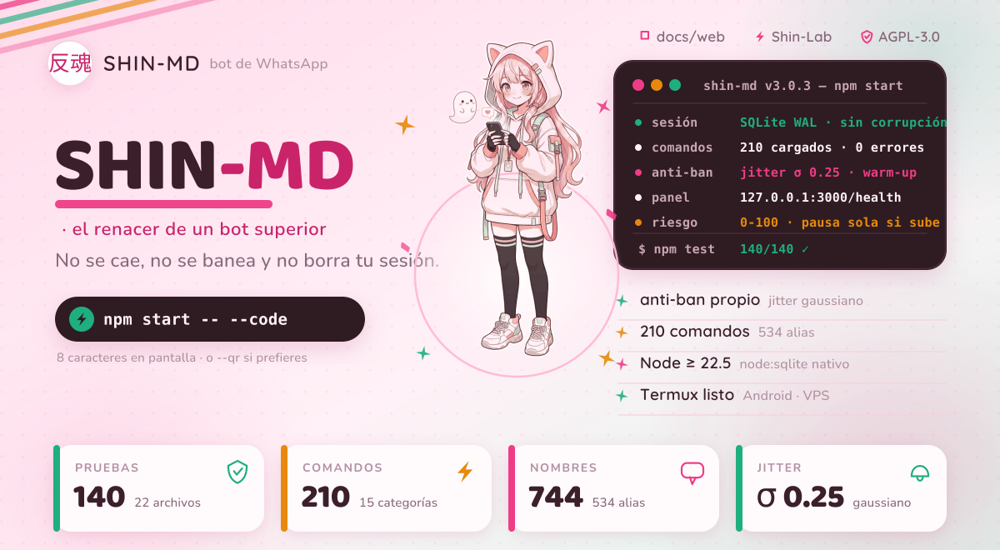

<br>

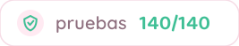
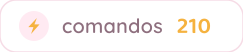
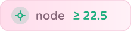

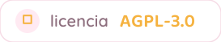
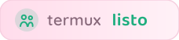

<br><br>

<!-- El único recurso externo del README: el badge del CI, porque su estado
     cambia en cada push. Si quieres cero peticiones a terceros, borra esta línea. -->
[](https://github.com/riokuroxi-svg/Shin-MD/actions)

**El bot de WhatsApp que no se cae, no se banea y no borra tu sesión.**

210 comandos · anti-ban nativo · Node ≥ 22.5 · sin servicios de terceros en medio.

[🌐 Página del proyecto](docs/web/index.html) ·
[⚡ Instalar](#instalación-en-5-minutos) ·
[🧩 Comandos](#los-210-comandos) ·
[🛡️ Anti-ban](#el-anti-ban-por-dentro) ·
[📜 Licencia](#licencia-y-marca) ·
[🧪 Shin-Lab](https://github.com/riokuroxi-svg/Shin-Lab)

</div>

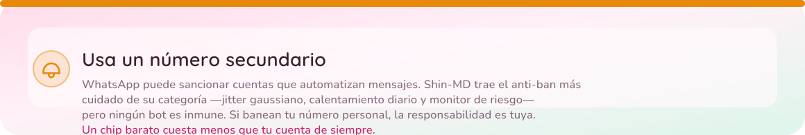

<h2 id="lo-que-lo-hace-distinto">Lo que lo hace distinto</h2>

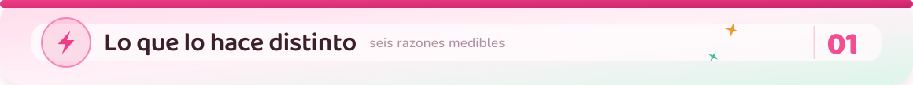

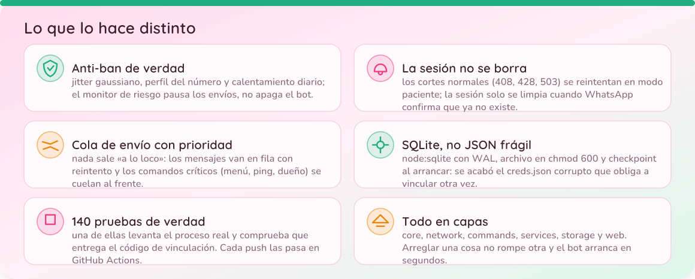

<h2 id="el-anti-ban-por-dentro">El anti-ban por dentro</h2>

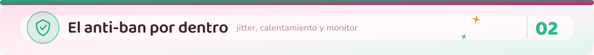

Nada de «espero un `Math.random()`». Esto es lo que hace que el bot parezca una
persona y se proteja solo:

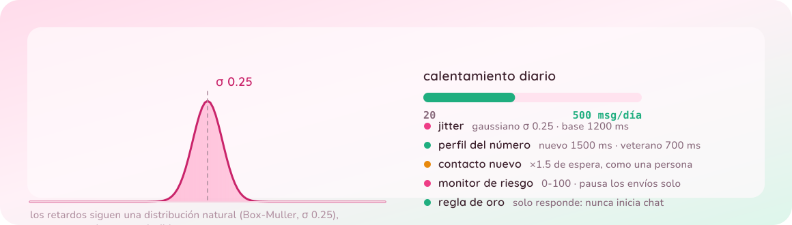

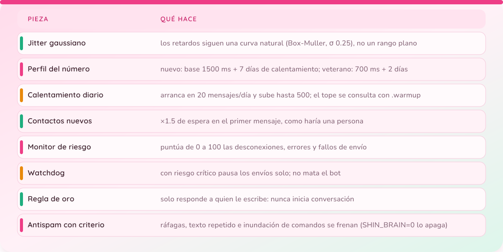

<details>
<summary><b>Huella de Shin-MD (marcador de obras derivadas)</b></summary>

El motor anti-ban tiene una combinación de parámetros propia:

`shinJitter` gaussiano σ 0.25 · base **1200 ms** (400–5000, +25 ms por carácter)
· perfil nuevo **1500 ms** / veterano **700 ms** · penalización **×1.5** a
contactos nuevos · calentamiento **20→500** mensajes/día en **7 días**

Si ves esos parámetros exactos en otro bot, es una obra derivada de Shin-MD y
debe cumplir la atribución de la Sección 7 del `NOTICE`.

</details>

<h2 id="los-210-comandos">Los 210 comandos</h2>

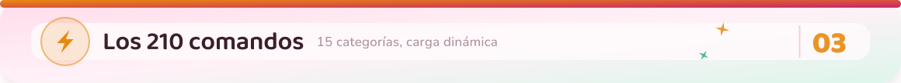

Escribe `.menu` dentro de WhatsApp y verás la tarjeta con botones y la lista
desplegable por categorías.

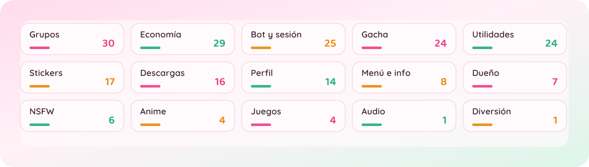

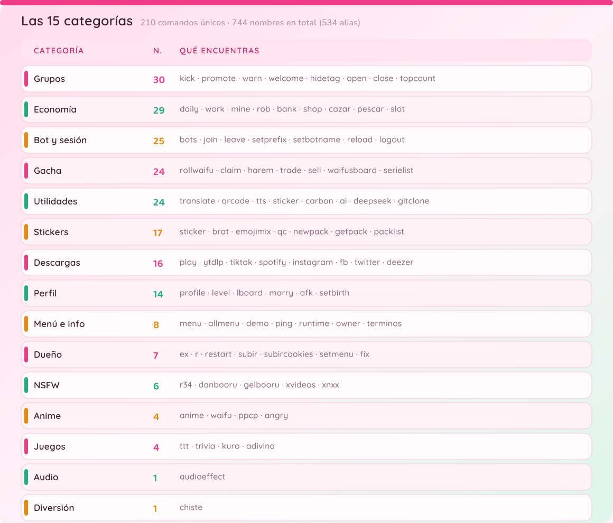

**210 comandos únicos · 744 nombres en total (534 alias) · 15 categorías.** Nombres de
ejemplo: `.play` (y sus alias `yt`, `mp3`, `musica`), `.sticker` (`s`),
`.daily` (`diario`, `recompensa`), `.w` (`work`, `trabajar`), `.x` para Twitter,
`.ig` para Instagram y `.menu` (`ayuda`, `h`).

🔑 *Instagram y Pinterest usan `FASTSAVER_KEY` (gratis en api.fastsaver.io).
Twitter funciona sin clave, pero es más estable con ella.*

<details>
<summary><b>Ver la lista completa de comandos (se genera del propio bot)</b></summary>

La página **[docs/web/index.html](docs/web/index.html)** lleva los 210 con su
buscador, filtros por categoría y descripción. Para regenerarla cuando añadas
comandos:

```bash
npm run docs:web
```

</details>

<h2 id="panel-local">Panel local</h2>

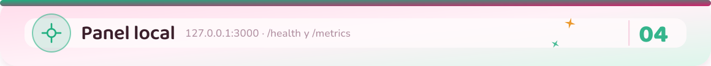

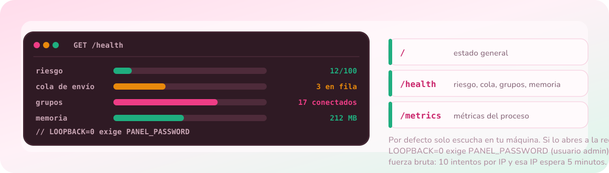

<h2 id="instalación-en-5-minutos">Instalación en 5 minutos</h2>

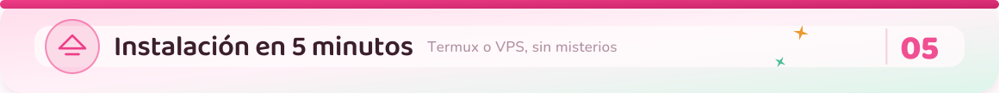

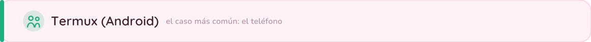

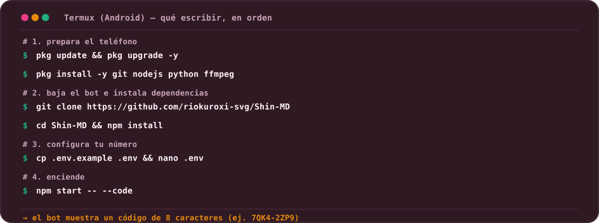

En WhatsApp: **Dispositivos vinculados → Vincular con número de teléfono**.
¿Prefieres QR? `npm start -- --qr`.

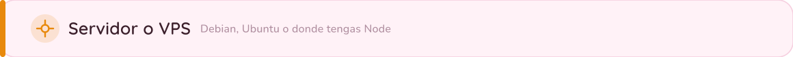

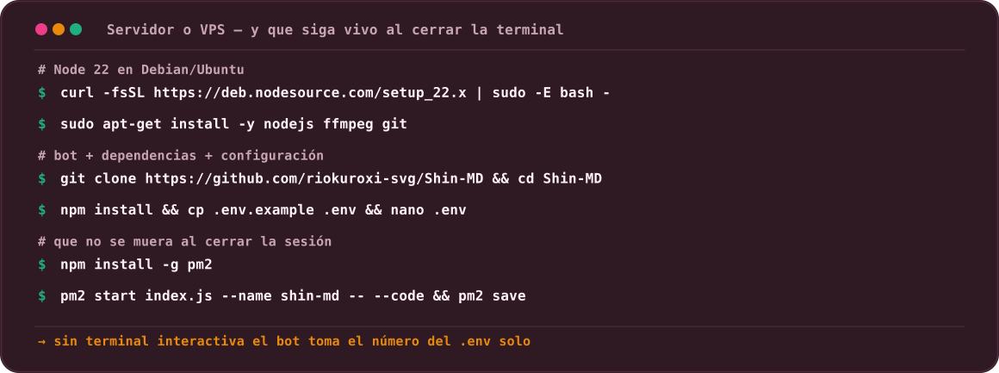

<h2 id="cómo-está-hecho">Cómo está hecho</h2>

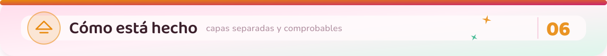

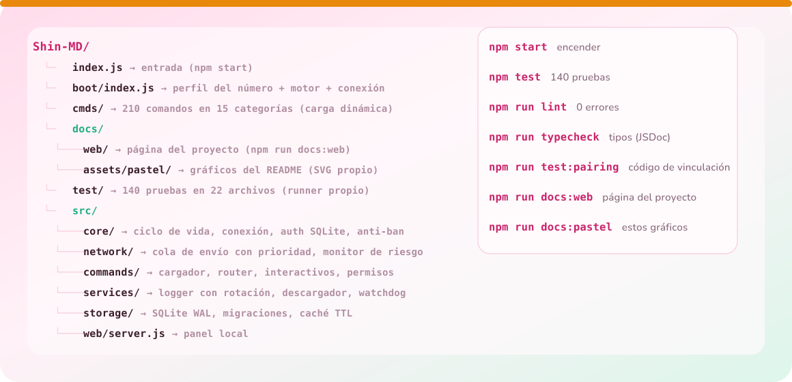

<details>
<summary><b>Regenerar los gráficos del README (trazo vectorial, sin fuentes externas)</b></summary>

Las imágenes de arriba se generan solas y leen los números reales del bot
(`docs/assets/datos.json` si está; si no, los valores de respaldo del script),
así que nunca enseñan una cifra vieja. No usan fuentes de terceros ni peticiones
a internet: el texto va convertido a **trazado vectorial**, y así se dibuja
idéntico en cualquier móvil o navegador.

```bash
npm run docs:pastel        # o directamente: python3 tools/build_pastel.py
```

La primera vez hace falta `python3 -m pip install fonttools cairosvg pillow`
(y `fonts-noto-cjk` en Debian/Ubuntu para el kanji 反魂).

</details>

<h2 id="el-laboratorio">El laboratorio</h2>

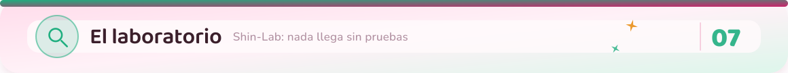

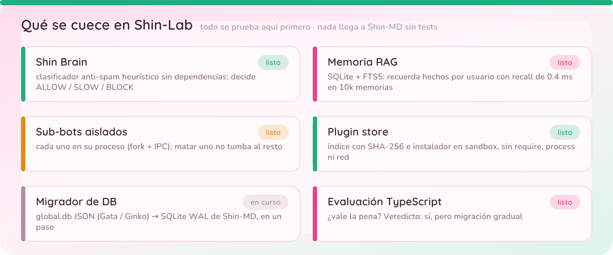

Todo lo experimental vive en [**Shin-Lab**](https://github.com/riokuroxi-svg/Shin-Lab).
**Nada migra a este repositorio sin estar probado.**

<h2 id="licencia-y-marca">Licencia y marca</h2>

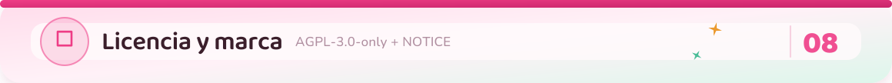

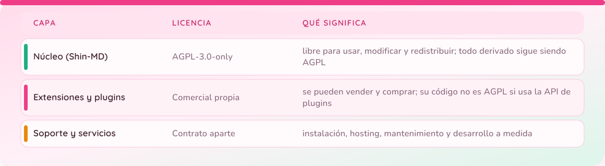

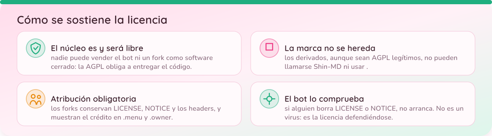

<h2 id="créditos">Créditos</h2>

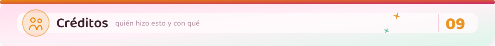

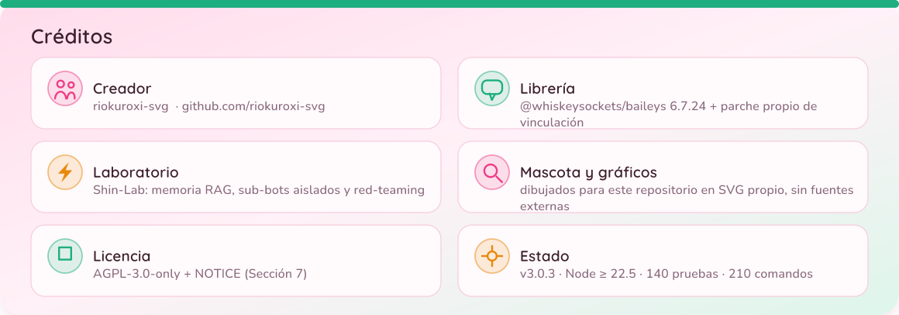

<div align="center">

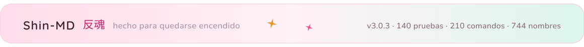

</div>
