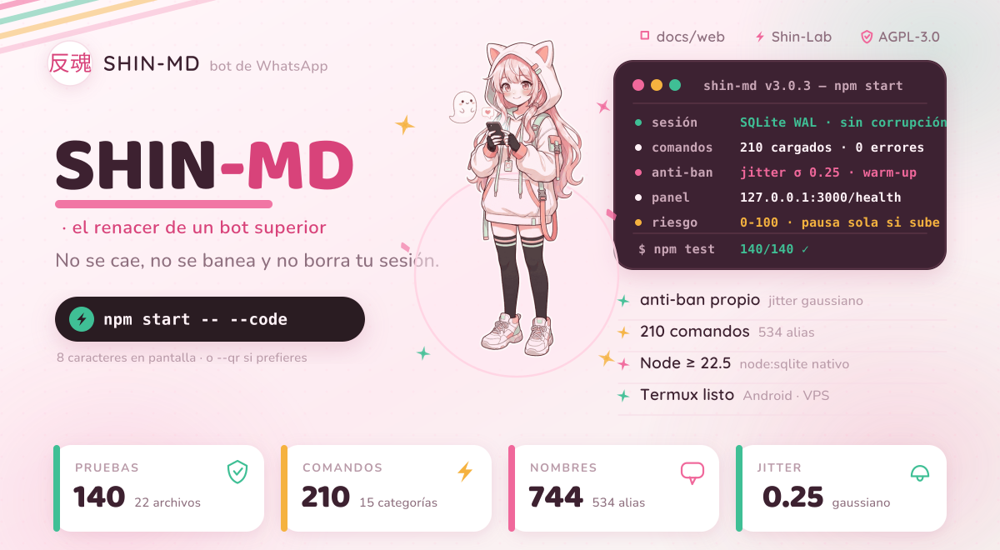
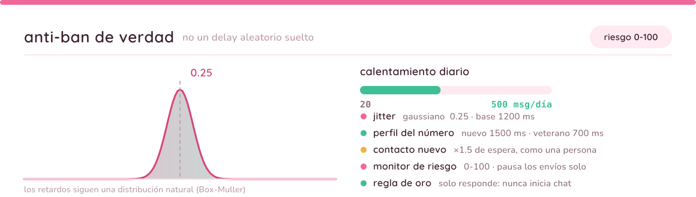
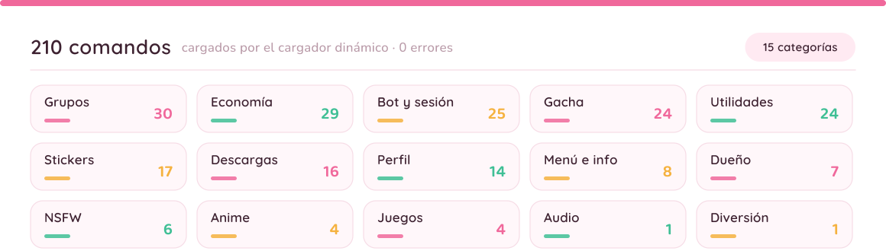
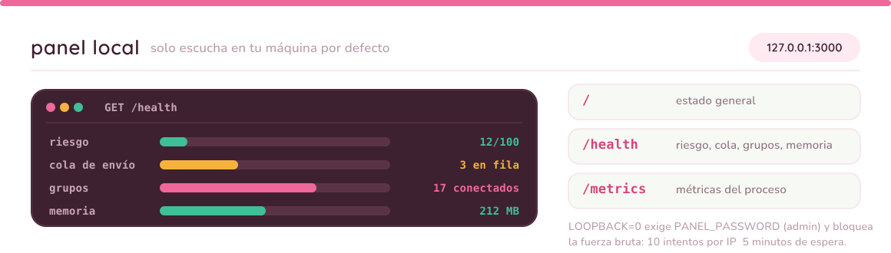

<div align="center">

<picture>
  <source media="(prefers-color-scheme: dark)" srcset="docs/assets/pastel/hero-oscuro.svg">
  
</picture>

<br>

<!-- Insignias propias: son SVG del repositorio (no dependen de ningún
     servicio externo) y llevan su propio fondo, así que se leen igual en
     tema claro y oscuro. -->


<!-- El único badge remoto: el estado del CI cambia en cada push y no se puede
     dibujar de antemano. Si prefieres cero peticiones externas, borra esta línea. -->
[](https://github.com/riokuroxi-svg/Shin-MD/actions)

**El bot de WhatsApp que no se cae, no se banea y no borra tu sesión.**

210 comandos · anti-ban nativo · Node ≥ 22.5 · sin servicios de terceros en medio.

[🌐 Página del proyecto](docs/web/index.html) ·
[⚡ Instalar](#-instalación-en-5-minutos) ·
[🧩 Comandos](#-los-210-comandos) ·
[🛡️ Anti-ban](#-el-anti-ban-por-dentro) ·
[📜 Licencia](#-licencia-y-marca) ·
[🧪 Shin-Lab](https://github.com/riokuroxi-svg/Shin-Lab)

<picture>
  <source media="(prefers-color-scheme: dark)" srcset="docs/assets/pastel/divisor-oscuro.svg">
  
</picture>

</div>

> ### ⚠️ Usa un número secundario
> WhatsApp puede sancionar cuentas que automatizan mensajes. Shin-MD trae el
> anti-ban más cuidado de su categoría —jitter gaussiano, calentamiento diario
> y monitor de riesgo— pero **ningún bot es inmune**. Si banean tu número
> personal, la responsabilidad es tuya. Un chip barato cuesta menos que tu
> cuenta de siempre.

## 🏆 Lo que lo hace distinto

- **Anti-ban de verdad, no un `delay` aleatorio.** Los tiempos siguen una
  distribución gaussiana, el número tiene un perfil (nuevo o veterano) y un
  calentamiento diario que sube poco a poco. Un monitor de riesgo de 0 a 100
  pausa los envíos solo cuando detecta peligro, sin apagar el bot.
- **Tu sesión no se borra por un micro-corte de red.** Los cortes normales
  (408, 428, 503) se reintentan en modo paciente; solo se limpia la sesión
  cuando WhatsApp confirma que ya no existe. En Termux eso es la diferencia
  entre un bot que dura meses y uno que hay que vincular cada semana.
- **Cola de envío con prioridad.** Nada sale "a lo loco": los mensajes van en
  fila con reintento, y los comandos críticos (menú, ping, dueño) se cuelan al
  frente para responder al instante.
- **Autenticación en SQLite, no en JSON frágil.** `node:sqlite` con WAL,
  archivo `chmod 600` y checkpoint al arrancar: se acabó el `creds.json`
  corrompido que obliga a vincular de nuevo.
- **140 pruebas que arrancan el bot de verdad.** Una de ellas levanta el
  proceso real y comprueba que entrega el código de vinculación. Cada push las
  pasa en GitHub Actions.
- **Todo separado en capas.** `core`, `network`, `commands`, `services`,
  `storage`, `web`. Arreglar una cosa no rompe otra, y el bot arranca en
  segundos.

## 🔒 El anti-ban por dentro

<picture>
  <source media="(prefers-color-scheme: dark)" srcset="docs/assets/pastel/seccion-antiban-oscuro.svg">
  
</picture>

| Pieza | Qué hace |
|---|---|
| **Jitter gaussiano** | Los retardos siguen una distribución natural (Box-Muller, σ 0.25), no un rango plano y predecible. |
| **Perfil del número** | Nuevo: base 1500 ms + 7 días de calentamiento. Veterano: base 700 ms + 2 días. La fecha se guarda: no se reinicia en cada arranque. |
| **Calentamiento diario** | Empieza en 20 mensajes/día y sube hasta 500. El tope se consulta con `.warmup`. |
| **Penalización a contactos nuevos** | ×1.5 de espera para el primer contacto, como haría una persona. |
| **Monitor de riesgo (0-100)** | Puntúa desconexiones, errores y fallos de envío. |
| **Watchdog** | Con riesgo crítico pausa los envíos solo; no mata el bot. |
| **Regla de oro** | Solo responde a quien le escribe: nunca inicia conversación con desconocidos. |
| **Antispam con criterio** | Ráfagas, texto repetido e inundación de comandos se frenan (`.env`: `SHIN_BRAIN=0` lo apaga). |

<details>
<summary><b>Huella de Shin-MD (marcador de obras derivadas)</b></summary>

El motor anti-ban tiene una combinación de parámetros propia:

`shinJitter` gaussiano σ 0.25 · base **1200 ms** (400–5000, +25 ms por carácter)
· perfil nuevo **1500 ms** / veterano **700 ms** · penalización **×1.5** a
contactos nuevos · calentamiento **20→500** mensajes/día en **7 días**

Si ves esos parámetros exactos en otro bot, es una obra derivada de Shin-MD y
debe cumplir la atribución de la Sección 7 del `NOTICE`.

</details>

## 🧩 Los 210 comandos

<picture>
  <source media="(prefers-color-scheme: dark)" srcset="docs/assets/pastel/seccion-comandos-oscuro.svg">
  
</picture>

Escribe `.menu` dentro de WhatsApp y verás la tarjeta con botones y la lista
desplegable por categorías. Aquí están todas:

| Categoría | Comandos | Qué encuentras |
|---|:--:|---|
| 🗂️ **Grupos** | 30 | `kick` `promote` `warn` `welcome` `hidetag` `open` `close` `topcount` |
| 💰 **Economía** | 29 | `daily` `work` `mine` `rob` `bank` `shop` `cazar` `pescar` `slot` |
| 🤖 **Bot y sesión** | 25 | `bots` `join` `leave` `setprefix` `setbotname` `reload` `logout` |
| 🎴 **Gacha** | 24 | `rollwaifu` `claim` `harem` `trade` `sell` `waifusboard` `serielist` |
| 🔧 **Utilidades** | 24 | `translate` `qrcode` `tts` `sticker` `carbon` `ai` `deepseek` `gitclone` |
| 🏷️ **Stickers** | 17 | `sticker` `brat` `emojimix` `qc` `newpack` `getpack` `packlist` |
| ⬇️ **Descargas** | 16 | `play` `play2` `ytdlp` `tiktok` `spotify` `instagram` `fb` `twitter` `deezer` |
| 👤 **Perfil** | 14 | `profile` `level` `lboard` `marry` `afk` `setbirth` |
| 🧭 **Menú e info** | 8 | `menu` `allmenu` `demo` `ping` `runtime` `owner` `terminos` |
| 👑 **Dueño** | 7 | `ex` `r` `restart` `subir` `subircookies` `setmenu` `fix` |
| 🔞 **NSFW** | 6 | `r34` `danbooru` `gelbooru` `xvideos` `xnxx` |
| ⛩️ **Anime** | 4 | `anime` `waifu` `ppcp` `angry` |
| 🎮 **Juegos** | 4 | `ttt` `trivia` `kuro` `adivina` |
| 🔊 **Audio** | 1 | `audioeffect` |
| 😄 **Diversión** | 1 | `chiste` |

**210 comandos únicos · 744 nombres en total (534 alias) · 15 categorías.** Nombres de
ejemplo: `.play` (y sus alias `yt`, `mp3`, `musica`), `.sticker` (`s`),
`.daily` (`diario`, `recompensa`), `.w` (`work`, `trabajar`), `.x` para Twitter,
`.ig` para Instagram y `.menu` (`ayuda`, `h`).

🔑 *Instagram y Pinterest usan `FASTSAVER_KEY` (gratis en api.fastsaver.io).
Twitter funciona sin clave, pero es más estable con ella.*

<details>
<summary><b>Ver la lista completa de comandos (se genera del propio bot)</b></summary>

La página **[docs/web/index.html](docs/web/index.html)** lleva los 210 con su
buscador, filtros por categoría y descripción. Para regenerarla cuando añadas
comandos:

```bash
npm run docs:web
```

</details>

## 🖥️ Panel local

<picture>
  <source media="(prefers-color-scheme: dark)" srcset="docs/assets/pastel/seccion-panel-oscuro.svg">
  
</picture>

Con el bot encendido, abre `http://127.0.0.1:3000`:

| Ruta | Qué muestra |
|---|---|
| `/` | Estado general |
| `/health` | Riesgo, cola, grupos conectados, memoria |
| `/metrics` | Métricas del proceso |

Por defecto **solo escucha en tu máquina**. Si lo abres a la red (`LOOPBACK=0`)
exige `PANEL_PASSWORD`, valida el usuario `admin` y bloquea la fuerza bruta:
10 intentos fallidos por IP y esa IP espera 5 minutos.

## ⚡ Instalación en 5 minutos

### 📱 Termux (Android)

```bash
# 1. Prepara el teléfono
pkg update && pkg upgrade -y
pkg install -y git nodejs python ffmpeg

# 2. Baja el bot e instala sus dependencias
git clone https://github.com/riokuroxi-svg/Shin-MD
cd Shin-MD
npm install

# 3. Configura tu número
cp .env.example .env
nano .env          # OWNER_NUMBER, PAIRING_NUMBER y PAIRING_METHOD=code

# 4. Enciende
npm start -- --code
```

El bot te muestra un **código de 8 caracteres** (por ejemplo `7QK4-2ZP9`). En
WhatsApp: **Dispositivos vinculados → Vincular con número de teléfono**.
¿Prefieres QR? `npm start -- --qr`.

### 🖥️ Servidor o VPS

```bash
curl -fsSL https://deb.nodesource.com/setup_22.x | sudo -E bash -
sudo apt-get install -y nodejs ffmpeg git

git clone https://github.com/riokuroxi-svg/Shin-MD && cd Shin-MD
npm install
cp .env.example .env && nano .env
npm start

# que siga vivo al cerrar la terminal:
npm install -g pm2 && pm2 start index.js --name shin-md -- --code && pm2 save
```

> 💡 En un servidor sin terminal interactiva el bot toma el número del `.env`
> solo: nunca se queda esperando el teclado.

## 🗂️ Cómo está hecho

```text
Shin-MD/
├── index.js              → entrada (npm start)
├── boot/index.js         → perfil del número + motor + conexión
├── cmds/                 → 210 comandos en 15 categorías (carga dinámica)
├── docs/
│   ├── web/              → página del proyecto (se regenera con npm run docs:web)
│   └── assets/pastel/    → gráficos del README (SVG propio + mascota)
├── test/                 → 140 pruebas en 22 archivos (runner propio, sin dependencias)
└── src/
    ├── core/             → ciclo de vida, conexión, auth SQLite, motor anti-ban
    ├── network/          → cola de envío con prioridad, monitor de riesgo
    ├── commands/         → cargador, router, interactivos, permisos
    ├── services/         → logger con rotación, descargador, watchdog
    ├── storage/          → SQLite WAL, migraciones, caché TTL
    └── web/server.js     → panel local
```

```bash
npm start              # encender
npm test               # 140 pruebas
npm run lint           # 0 errores
npm run typecheck      # tipos (JSDoc) sin migrar a TypeScript
npm run test:pairing   # comprueba el código de vinculación de verdad
```

<details>
<summary><b>Regenerar los gráficos del README (trazo vectorial, sin fuentes externas)</b></summary>

Las imágenes de arriba se generan solas y leen los números reales del bot
(`docs/assets/datos.json` si está; si no, los valores de respaldo del script),
así que nunca enseñan una cifra vieja. No usan fuentes de terceros ni peticiones
a internet: el texto va convertido a **trazado vectorial**, y así se dibuja
idéntico en cualquier móvil o navegador.

```bash
npm run docs:pastel        # o directamente: python3 tools/build_pastel.py
```

La primera vez hace falta `python3 -m pip install fonttools cairosvg pillow`
(y `fonts-noto-cjk` en Debian/Ubuntu para el kanji 反魂).

</details>

## 🧪 El laboratorio

Todo lo experimental vive en [**Shin-Lab**](https://github.com/riokuroxi-svg/Shin-Lab):
memoria RAG, sub-bots aislados, registro de herramientas, red-teaming.
**Nada migra a este repositorio sin estar probado.**

## 📜 Licencia y marca

| Capa | Licencia | Qué significa |
|---|---|---|
| **Núcleo (Shin-MD)** | AGPL-3.0-only | Libre para usar, modificar y redistribuir. Todo derivado debe seguir siendo AGPL y publicar su código. |
| **Extensiones y plugins** | Comercial propia | Se pueden vender y comprar; su código no es AGPL mientras hablen solo con la API de plugins. |
| **Soporte y servicios** | Contrato aparte | Instalación, hosting, mantenimiento y desarrollo a medida. |

**Cuatro reglas que sostienen esto:**

1. **El núcleo es y será libre.** Nadie puede vender el bot ni un fork como
   software cerrado: la AGPL obliga a entregar el código.
2. **La marca no se hereda.** Los derivados, aunque sean AGPL legítimos, no
   pueden llamarse *Shin-MD* ni usar 反魂.
3. **Atribución obligatoria.** Los forks conservan `LICENSE`, `NOTICE` y los
   headers de cada archivo, y muestran el crédito en `.menu` y `.owner`.
4. **El bot lo comprueba.** Si alguien borra `LICENSE` o `NOTICE`, no arranca.
   No es un virus: es la licencia defendiéndose.

## ⭐ Créditos

- 🌿 **Creador:** [riokuroxi-svg](https://github.com/riokuroxi-svg) 🇲🇽
- 🤖 **Librería:** [@whiskeysockets/baileys](https://github.com/WhiskeySockets/Baileys) 6.7.24 + parche propio de vinculación
- 🧪 **Laboratorio:** [Shin-Lab](https://github.com/riokuroxi-svg/Shin-Lab)
- 🎨 **Mascota y gráficos:** dibujados a medida para este repositorio (SVG propio, sin fuentes externas)
- ⚖️ **Licencia:** AGPL-3.0-only + `NOTICE` (Sección 7)

<div align="center">
<br>
<picture>
  <source media="(prefers-color-scheme: dark)" srcset="docs/assets/pastel/pie-oscuro.svg">
  
</picture>
</div>
