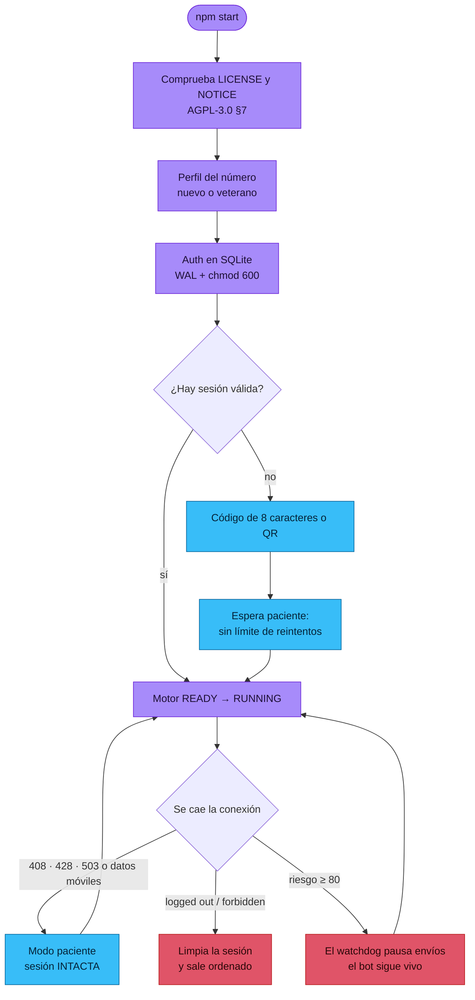

<div align="center">

<picture>
  <source media="(prefers-color-scheme: dark)" srcset="docs/assets/hero-oscuro.svg">
  
</picture>

<br>

<!-- Insignias dibujadas en casa (docs/assets): se animan solas y los números
     salen del propio repo con `npm run docs:assets`. No se escriben a mano. -->
<picture>
  <source media="(prefers-color-scheme: dark)" srcset="docs/assets/insignias-oscuro.svg">
  
</picture>

<br><br>

[](https://github.com/riokuroxi-svg/Shin-MD/actions)
[](LICENSE)
[](package.json)

**El bot de WhatsApp que no se cae, no se banea y no borra tu sesión.**

210 comandos · 744 nombres con alias · anti-ban nativo · Node ≥ 22.5 · sin servicios de terceros en medio.

[🌐 Página del proyecto](docs/web/index.html) ·
[⚡ Instalar](#-instalación-en-5-minutos) ·
[🌀 Cómo funciona](#-cómo-funciona-shin) ·
[🧩 Comandos](#-los-210-comandos) ·
[🔒 Anti-ban](#-el-anti-ban-por-dentro) ·
[🧯 Problemas típicos](#-problemas-típicos) ·
[📜 Licencia](#-licencia-y-marca) ·
[🧪 Shin-Lab](https://github.com/riokuroxi-svg/Shin-Lab)

</div>

---

> ### ⚠️ Usa un número secundario
> WhatsApp puede sancionar cuentas que automatizan mensajes. Shin-MD trae el
> anti-ban más cuidado de su categoría —jitter gaussiano, calentamiento diario
> y monitor de riesgo— pero **ningún bot es inmune**. Si banean tu número
> personal, la responsabilidad es tuya. Un chip barato cuesta menos que tu
> cuenta de siempre.

## 🏆 Lo que lo hace distinto

- **Anti-ban de verdad, no un `delay` aleatorio.** Los tiempos siguen una
  distribución gaussiana, el número tiene un perfil (nuevo o veterano) y un
  calentamiento diario que sube poco a poco. Un monitor de riesgo de 0 a 100
  pausa los envíos solo cuando detecta peligro, sin apagar el bot.
- **Tu sesión no se borra por un micro-corte de red.** Los cortes normales
  (408, 428, 503) se reintentan en modo paciente; solo se limpia la sesión
  cuando WhatsApp confirma que ya no existe. En Termux eso es la diferencia
  entre un bot que dura meses y uno que hay que vincular cada semana.
- **Cola de envío con prioridad.** Nada sale "a lo loco": los mensajes van en
  fila con reintento, y los comandos críticos (menú, ping, dueño) se cuelan al
  frente para responder al instante.
- **Autenticación en SQLite, no en JSON frágil.** `node:sqlite` con WAL,
  archivo `chmod 600` y checkpoint al arrancar: se acabó el `creds.json`
  corrompido que obliga a vincular de nuevo.
- **140 pruebas que arrancan el bot de verdad.** Una de ellas levanta el
  proceso real y comprueba que entrega el código de vinculación. Cada push las
  pasa en GitHub Actions.
- **Interfaz nativa, no solo texto.** Botones, listas desplegables, encuestas,
  álbumes, notas de voz con onda dibujada y menús que se adaptan al día o a la
  noche. Si el WhatsApp del usuario no sabe mostrarlo, el bot cae solo a texto.

## ⚡ Instalación en 5 minutos

### 📱 Termux (Android)

```bash
# 1. Prepara el teléfono
pkg update && pkg upgrade -y
pkg install -y git nodejs python ffmpeg

# 2. Baja el bot e instala sus dependencias
git clone https://github.com/riokuroxi-svg/Shin-MD
cd Shin-MD
npm install

# 3. Configura tu número
cp .env.example .env
nano .env          # OWNER_NUMBER, PAIRING_NUMBER y PAIRING_METHOD=code

# 4. Enciende
npm start -- --code
```

El bot te muestra un **código de 8 caracteres** (por ejemplo `7QK4-2ZP9`). En
WhatsApp: **Dispositivos vinculados → Vincular con número de teléfono**.
¿Prefieres QR? `npm start -- --qr`.

### 🖥️ Servidor o VPS

```bash
curl -fsSL https://deb.nodesource.com/setup_22.x | sudo -E bash -
sudo apt-get install -y nodejs ffmpeg git

git clone https://github.com/riokuroxi-svg/Shin-MD && cd Shin-MD
npm install
cp .env.example .env && nano .env
npm start

# que siga vivo al cerrar la terminal:
npm install -g pm2 && pm2 start index.js --name shin-md -- --code && pm2 save
```

> 💡 En un servidor sin terminal interactiva el bot toma el número del `.env`
> solo: nunca se queda esperando el teclado.

### 🎛️ Lo mínimo que hay que tocar en `.env`

| Variable | Para qué | Por defecto |
|---|---|---|
| `OWNER_NUMBER` | **Obligatoria.** Tu número (el personal), solo dígitos | — |
| `PAIRING_METHOD` | `code` (código de 8 caracteres) o `qr` | `code` |
| `NUMBER_PROFILE` | `nuevo` (1500 ms + 7 días) o `veterano` (700 ms + 2 días) | `nuevo` |
| `PORT` / `LOOPBACK` | Panel local y si se abre a tu red | `3000` / `1` |
| `WARMUP_LIMIT=0` | Quita el tope diario (los retardos **se mantienen**) | tope activo |
| `SHIN_BRAIN=0` | Apaga el antispam (ráfagas y flood) | encendido |

Todo está comentado dentro de `.env.example`, con el resto de opciones.

## 🌀 Cómo funciona Shin

Tres vistas del mismo bot: lo que **ves**, lo que **pasa por dentro** y lo que
**decide solo** cuando algo va mal.

### 1) Lo que ves en WhatsApp

<picture>
  <source media="(prefers-color-scheme: dark)" srcset="docs/assets/chat-demo.svg">
  
</picture>

### 2) Lo que pasa por dentro cuando escribes `.menu`

<picture>
  <source media="(prefers-color-scheme: dark)" srcset="docs/assets/flujo-mensaje.svg">
  
</picture>

| Etapa | Quién la hace | Qué decide |
|---|---|---|
| Antispam | `src/lib/brain.js` | Ráfagas, texto repetido y flood de comandos: se frenan antes de molestar al motor. |
| Router | `src/commands/router.js` | Prefijo (`. / # !`), alias, self-mode y cooldown por usuario. |
| Permisos | `src/commands/middleware/permissions.js` | ¿Es admin del grupo? ¿Es el dueño? ¿El bot puede administrar? |
| Handler | `cmds/**` | El comando en sí: 210 repartidos en 15 categorías, con carga dinámica y recarga en caliente. |
| Cola | `src/network/queue.js` | Prioridad para `.menu` `.ping` `.owner`, reintentos y tope de 120 s por envío. |
| Envío | `src/core/engine/throttler.js` | Retardo gaussiano, penalización por contacto nuevo y tope del calentamiento diario. |

### 3) Cómo arranca y cómo se recupera solo



<details>
<summary><b>Los cinco estados del motor (y por qué no se queda colgado)</b></summary>

`boot/index.js` monta el motor por fases — `BOOT → INIT → CONNECT → READY →
RUNNING` — y cada fase deja el proceso en un estado conocido. Si algo revienta
a mitad, el watchdog lo detecta:

- **Cola atascada**: ningún envío bloquea a los demás más de 120 s.
- **Socket mudo**: 5 minutos sin actividad en estado CONNECT+ ⇒ reconexión.
- **Riesgo alto**: ≥ 80 pausa la cola, ≥ 95 reconecta. Tras 3 intentos sin
  alivio, el bot lo dice en voz alta en vez de martillear la sesión.
- **Nunca borra una sesión válida**: una tormenta de reconexiones termina el
  proceso con el `auth.db` intacto y un aviso claro.

</details>

## 🧩 Los 210 comandos

Escribe `.menu` dentro de WhatsApp y verás la tarjeta con botones y la lista
desplegable por categorías. Aquí están todas:

| Categoría | Comandos | Qué encuentras |
|---|:--:|---|
| 🗂️ **Grupos** | 30 | `kick` `promote` `warn` `welcome` `hidetag` `open` `close` `topcount` |
| 💰 **Economía** | 29 | `daily` `work` `mine` `rob` `bank` `shop` `cazar` `pescar` `slot` |
| 🤖 **Bot y sesión** | 25 | `bots` `join` `leave` `setprefix` `setbotname` `reload` `logout` |
| 🎴 **Gacha** | 24 | `rollwaifu` `claim` `harem` `trade` `sell` `waifusboard` `serielist` |
| 🔧 **Utilidades** | 24 | `translate` `qrcode` `tts` `sticker` `carbon` `ai` `deepseek` `gitclone` |
| 🏷️ **Stickers** | 17 | `sticker` `brat` `emojimix` `qc` `newpack` `getpack` `packlist` |
| ⬇️ **Descargas** | 16 | `play` `play2` `ytdlp` `tiktok` `spotify` `instagram` `fb` `twitter` `deezer` |
| 👤 **Perfil** | 14 | `profile` `level` `lboard` `marry` `afk` `setbirth` |
| 🧭 **Menú e info** | 8 | `menu` `allmenu` `demo` `ping` `runtime` `owner` `terminos` |
| 👑 **Dueño** | 7 | `ex` `r` `restart` `subir` `subircookies` `setmenu` `fix` |
| 🔞 **NSFW** | 6 | `r34` `danbooru` `gelbooru` `xvideos` `xnxx` |
| ⛩️ **Anime** | 4 | `anime` `waifu` `ppcp` `angry` |
| 🎮 **Juegos** | 4 | `ttt` `trivia` `kuro` `adivina` |
| 🔊 **Audio** | 1 | `audioeffect` |
| 😄 **Diversión** | 1 | `chiste` |

**210 comandos únicos · 534 alias (744 nombres) · 15 categorías · 5 hooks.**
La mitad del código viene con nombre corto para escribir rápido: `.play` (`yt`,
`mp3`, `musica`), `.sticker` (`s`), `.daily` (`diario`, `recompensa`), `.w`
(`work`, `trabajar`), `.x` para Twitter y `.ig` para Instagram.

🔑 *Instagram y Pinterest usan `FASTSAVER_KEY` (gratis en api.fastsaver.io).
Twitter funciona sin clave, pero es más estable con ella.*

<details>
<summary><b>Ver la lista completa de comandos (se genera del propio bot)</b></summary>

La página **[docs/web/index.html](docs/web/index.html)** lleva los 210 con su
buscador, filtros por categoría y descripción. Para regenerarla cuando añadas
comandos:

```bash
npm run docs:web
```

</details>

## 🔒 El anti-ban por dentro

Nada de "espero un `Math.random()`". Esto es lo que hace que el bot parezca
una persona y se proteja solo:

<picture>
  <source media="(prefers-color-scheme: dark)" srcset="docs/assets/medidor-riesgo.svg">
  
</picture>

| Pieza | Qué hace |
|---|---|
| **Jitter gaussiano** | Los retardos siguen una distribución natural (Box-Muller, σ 0.25), no un rango plano y predecible. |
| **Perfil del número** | Nuevo: base 1500 ms + 7 días de calentamiento. Veterano: base 700 ms + 2 días. La fecha se guarda: no se reinicia en cada arranque. |
| **Calentamiento diario** | Empieza en 20 mensajes/día y sube hasta 500. El tope se consulta con `.warmup`. |
| **Penalización a contactos nuevos** | ×1.5 de espera para el primer contacto, como haría una persona. |
| **Monitor de riesgo (0-100)** | Puntúa desconexiones, errores y fallos de envío de la última hora. |
| **Watchdog** | Con riesgo crítico pausa los envíos solo; no mata el bot. |
| **Regla de oro** | Solo responde a quien le escribe: nunca inicia conversación con desconocidos. |
| **Antispam con criterio** | Ráfagas, texto repetido e inundación de comandos se frenan (`.env`: `SHIN_BRAIN=0` lo apaga). |

### El antispam y el tope diario no son lo mismo

- **Antispam (`.env`: `SHIN_BRAIN`)** → protege al bot de *quien le escribe*:
  corta ráfagas y flood antes de que lleguen al motor.
- **Tope del calentamiento (`WARMUP_LIMIT`)** → protege al *número*: al llegar
  al máximo del día los comandos normales esperan, pero `.menu`, `.ping`, las
  reacciones y las respuestas directas **siguen pasando** (es lo menos
  baneable que existe). No es un apagón: es una pausa con aviso.

<details>
<summary><b>Huella de Shin-MD (marcador de obras derivadas)</b></summary>

El motor anti-ban tiene una combinación de parámetros propia:

`shinJitter` gaussiano σ 0.25 · base **1200 ms** (400–5000, +25 ms por carácter)
· perfil nuevo **1500 ms** / veterano **700 ms** · penalización **×1.5** a
contactos nuevos · calentamiento **20→500** mensajes/día en **7 días**

Si ves esos parámetros exactos en otro bot, es una obra derivada de Shin-MD y
debe cumplir la atribución de la Sección 7 del `NOTICE`.

</details>

## 🖥️ Panel local

Con el bot encendido, abre `http://127.0.0.1:3000`:

| Ruta | Qué muestra |
|---|---|
| `/` | Estado general |
| `/health` | Riesgo, cola, grupos conectados, memoria |
| `/metrics` | Métricas del proceso |

Por defecto **solo escucha en tu máquina**. Si lo abres a la red (`LOOPBACK=0`)
exige `PANEL_PASSWORD`, valida el usuario `admin` y bloquea la fuerza bruta:
10 intentos fallidos por IP y esa IP espera 5 minutos.

## 🗂️ Cómo está hecho

```
Shin-MD/
├── index.js              → entrada (npm start)
├── boot/index.js         → perfil del número + motor + conexión
├── cmds/                 → 210 comandos en 15 categorías (carga dinámica)
├── docs/
│   ├── assets/           → todos los SVG del README (npm run docs:assets)
│   └── web/              → página del proyecto (npm run docs:web)
├── test/                 → 140 pruebas en 22 archivos (runner propio, sin dependencias)
└── src/
    ├── core/             → ciclo de vida, conexión, auth SQLite, motor anti-ban
    ├── network/          → cola de envío con prioridad, monitor de riesgo
    ├── commands/         → cargador, router, interactivos, permisos
    ├── services/         → logger con rotación, descargador, watchdog
    ├── storage/          → SQLite WAL, migraciones, caché TTL
    ├── lib/              → formateo, tarjetas, límites, herramientas
    └── web/server.js     → panel local
```

```bash
npm start             # encender
npm test              # 140 pruebas (acepta filtro: npm test -- web)
npm run lint          # 0 errores
npm run typecheck     # tipos (JSDoc) sin migrar a TypeScript
npm run docs:web      # regenera la página del proyecto
npm run docs:assets   # redibuja los SVG del README con los números reales
npm run test:pairing  # comprueba el código de vinculación de verdad
```

## 🧯 Problemas típicos

<details>
<summary><b>El bot arranca pero no responde a los comandos</b></summary>

Casi siempre es el tope diario del calentamiento. Míralo con `.warmup`: si estás
en el día 1, son 20 mensajes al día. `.menu` y `.ping` siguen funcionando
justo para eso. Puedes subir el tope con `WARMUP_START_MSGS` / `WARMUP_MAX_MSGS`
o quitarlo con `WARMUP_LIMIT=0` (los retardos gaussianos se mantienen).

</details>

<details>
<summary><b>No consigo vincular un dispositivo nuevo</b></summary>

El parche de vinculación de Baileys se aplica en el `postinstall`. Si solo
hiciste `git pull`, el `node_modules` quedó viejo: corre otra vez

```bash
npm install
```

El bot lo avisa en el arranque si detecta que el parche falta.

</details>

<details>
<summary><b>¿Voy a perder la sesión cada vez que se corte la red?</b></summary>

No. Los cortes 408/428/503 y las desconexiones de datos móviles entran en modo
paciente (reintento cada ~5 min) con el `auth.db` intacto. Solo se limpia la
sesión cuando WhatsApp confirma que ya no existe (logged out, forbidden,
multidevice mismatch). Si el proceso muere por una tormenta de reconexiones,
sale con un mensaje claro y **sin** borrar credenciales.

</details>

<details>
<summary><b>¿Qué pasa si mi hosting no guarda archivos entre deploys?</b></summary>

Fija `WARMUP_START_DATE=AAAA-MM-DD` con el día en que empezaste a usar el
número, o el calentamiento se reiniciará en el día 0 (20 mensajes/día) cada
vez que despliegues.

</details>

## 🧪 El laboratorio

Todo lo experimental vive en [**Shin-Lab**](https://github.com/riokuroxi-svg/Shin-Lab):
memoria RAG, sub-bots aislados, registro de herramientas, red-teaming.
**Nada migra a este repositorio sin estar probado.**

## 📜 Licencia y marca

| Capa | Licencia | Qué significa |
|---|---|---|
| **Núcleo (Shin-MD)** | AGPL-3.0-only | Libre para usar, modificar y redistribuir. Todo derivado debe seguir siendo AGPL y publicar su código. |
| **Extensiones y plugins** | Comercial propia | Se pueden vender y comprar; su código no es AGPL mientras hablen solo con la API de plugins. |
| **Soporte y servicios** | Contrato aparte | Instalación, hosting, mantenimiento y desarrollo a medida. |

**Cuatro reglas que sostienen esto:**

1. **El núcleo es y será libre.** Nadie puede vender el bot ni un fork como
   software cerrado: la AGPL obliga a entregar el código.
2. **La marca no se hereda.** Los derivados, aunque sean AGPL legítimos, no
   pueden llamarse *Shin-MD* ni usar 反魂.
3. **Atribución obligatoria.** Los forks conservan `LICENSE`, `NOTICE` y los
   headers de cada archivo, y muestran el crédito en `.menu` y `.owner`.
4. **El bot lo comprueba.** Si alguien borra `LICENSE` o `NOTICE`, no arranca.
   No es un virus: es la licencia defendiéndose.

<details>
<summary><b>Procedencia del código (Shin original + linaje Ginko)</b></summary>

El detalle está en **[docs/PROCEDENCIA.md](docs/PROCEDENCIA.md)**: el motor
anti-ban, la capa de resiliencia, el panel web y los comandos nativos son
autoría de riokuroxi-svg; el resto viene del linaje Ginko / YukiBot (MIT),
reescrito y adaptado aquí bajo AGPL-3.0-only. El propio cargador de comandos
informa del reparto real en cada arranque (una línea del log: "N Shin, M
Ginko"). Los plugins comerciales viven fuera del núcleo.

</details>

## ⭐ Créditos

- 🌿 **Creador:** [riokuroxi-svg](https://github.com/riokuroxi-svg) 🇲🇽
- 🤖 **Librería:** [@whiskeysockets/baileys](https://github.com/WhiskeySockets/Baileys) 6.7.24 + parche propio de vinculación
- 🧪 **Laboratorio:** [Shin-Lab](https://github.com/riokuroxi-svg/Shin-Lab)
- ⚖️ **Licencia:** AGPL-3.0-only + `NOTICE` (Sección 7)

<div align="center">
<br>
<picture>
  <source media="(prefers-color-scheme: dark)" srcset="docs/assets/divisor-oscuro.svg">
  
</picture>
<br>
<b>反魂 Shin-MD</b> · hecho para quedarse encendido
<br><br>
<sub>Los SVG de este README se dibujan solos con <code>npm run docs:assets</code>: ningún número está escrito a mano.</sub>
</div>
